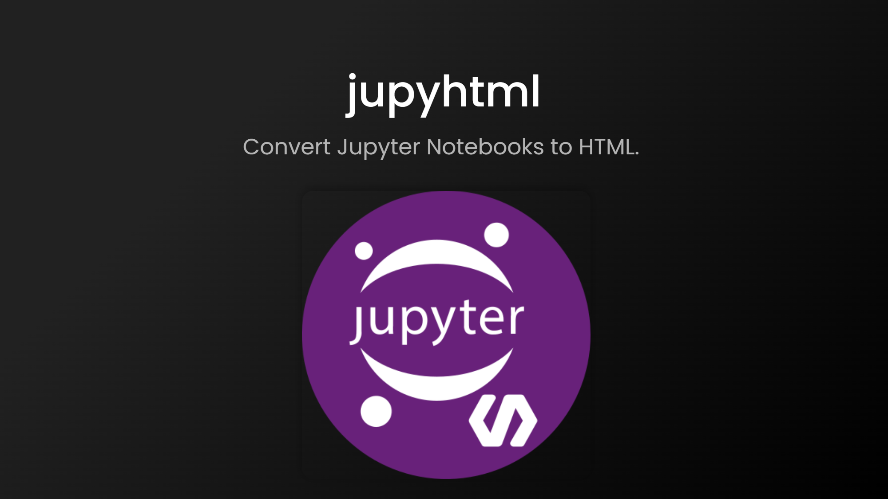

# jupyhtml
Convert Jupyter Notebooks to HTML.  

Windons executable can be downloaded on the following link:  
  
   

## How it Works
Drag and drop ipynb files to jupyhtml.exe.

To run jupyhtml, you must install the jupyter notebook.  

## Share

&emsp;
&emsp;
&emsp;
&emsp; 
