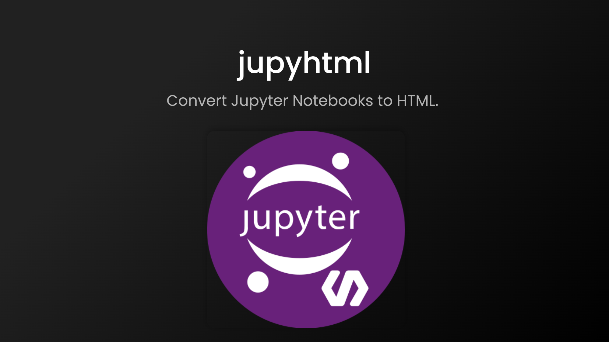

# jupyhtml
Convert Jupyter Notebooks to HTML.  

Windons executable can be downloaded on the following link:  
[**jupyhtml.zip**](https://github.com/RyokoKuga/jupyhtml/releases/download/v1.0.0/jupyhtml.zip)  

**Drag and drop ipynb files to jupyhtml.exe to convert them to HTML.**
